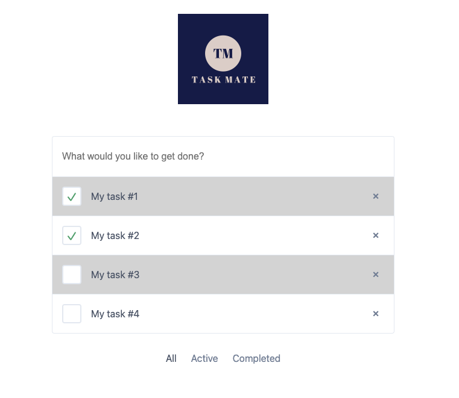
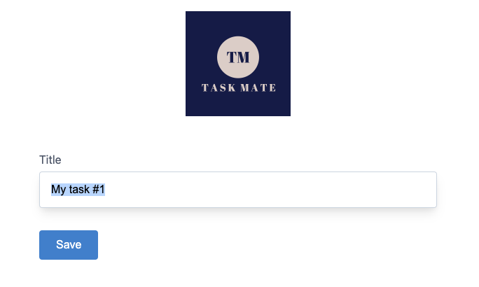

# task-mate
## A TypeScript React Portfolio Project


___

This project was largely built in tandem with the Udemy course [Using TypeScript with React](https://www.udemy.com/course/react-with-typescript/) with porting of MySQL to MongoDB and various changes as needed for updated dependencies since the release of the course.

I created this project to learn how to use TypeScript in tandem with React as well as start using Next.js which is the recommended React environment over Create-React-App. Although I am familiar with using MySQL, I intentionally shifted to using MongoDB during the course to gain a thorough understanding of TypeScript. This allowed me to use TypeScript effectively irrespective of the database or environment I choose to work with.

[You can see the deployed live site here](https://task-tracker-mate.herokuapp.com/completed)
___

## Description

Task mate enables users to create and manage task reminders with use of Next.js, React, TypeScript, GraphQL, and MongoDB.

## Table of Contents

* [Installation](#installation)
* [Usage](#usage)
* [Credits](#credits)
* [License](#license)
* [Questions](#questions)

## Installation

Run the following command to install this locally:

```
npm install
```

To run off your own MongoDB cloud database, insert a .env file at the root level and insert the following variable:

```
REACT_APP_MONGODB_URI=<YOUR_MONGODB_CLUSTER>
```

If you choose to also deploy this on your own cloud-based PaaS (e.g. Heroku), you will need to update the dynamicUri located within lib/client.ts.


## Usage

_<p align="center">Landing page</p>_ 


_<p align="center">Edit Task</p>_ 


After installing the app or launching the deployed link, the User can either:
- Add a task: To add a task, type a new task in the text field on the landing page and press ENTER afterwards to insert the new task (which is by automatically set as active). 
- Edit a task: To edit a task title, click on the individual task title itself on the landing page which will lead to the original task title in a text field. Edit to your preference and press save afterwards.
- Delete a task: To delete a task, simply press the X to the far right of a task on the landing page.
- Toggle viewing of tasks based on status: To view the tasks based on status, click on the appropriate status at the end of the task list.

## Credits

[Using TypeScript with React](https://www.udemy.com/course/react-with-typescript/)

[Next js + GraphQL + TypeScript Setup](https://github.com/ivanms1/nextjs-apollo-ssr)

## Thoughts
I initially expected the implementation of this app to be straightforward because of my familiarity with the MERN stack and vanilla JavaScript. While my background knowledge did help in the learning process, the main focus of this app was on understanding TypeScript. However, I encountered friction initially and had the urge to convert files to JavaScript instead. Additionally, I deliberately chose to use MongoDB instead of MySQL, which was used in the course, to challenge myself and not solely rely on the lectures for working code. I knew that this decision would come with more difficulty, but I believed it would lead to a better understanding of TypeScript. Despite facing initial confusion and troubleshooting, I found that towards the end of the project, I became more comfortable and developed a better intuition for TypeScript, making this choice worthwhile.


## License
    
This project is licensed under the MIT License. To learn more about this license, go to:

https://opensource.org/licenses/MIT 

## Questions

Questions, comments, concerns? Send me an email at rhong24@gmail.com.
